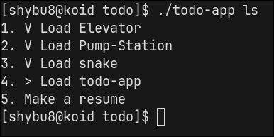

 # Todo App (CLI + Network Backend)
 ---

Простой todo-менеджер с возможностью работы:
- через файловую систему
- через TCP-сервер

## Возможности
- Добавление задач
- Просмотр списка
- Просмотр содержимого
- Удаление
- Изменение статуса
- Два режима работы:
  - локальный (`~/.todo` или в `TODO_DATA`)
  - сетевой (через TCP)

## Использование
```bash
todo-app add
todo-app ls
todo-app get NUM
todo-app rm NUM
todo-app set NUM (undone|in_progress|done)
```

## Скриншоты


## Хранение данных
Поддерживаются два режима хранения данных:
- Локальный:
    - По умолчанию в `~/.todo`
    - Через переменную окражуения `TODO_DATA=/dir/dir`
- Сетевой. Через переменную окражения `TODO_DATA=IP:9999` (однако сервер по умолчанию работает на порту 9999 и хранит данные в `~/.todo`)

## Архитектура, основные компоненты
- Todo — модель задачи
- TodoDB — интерфейс хранилища
- TodoDBFs — файловая реализация
- TodoDBNetClient — сетевой клиент
- server.cpp — TCP сервер
- namespace Protocol — сериализация/парсинг сообщений

## Ограничения
Протокол не осуществляет обратную связь в случае ошибки.
